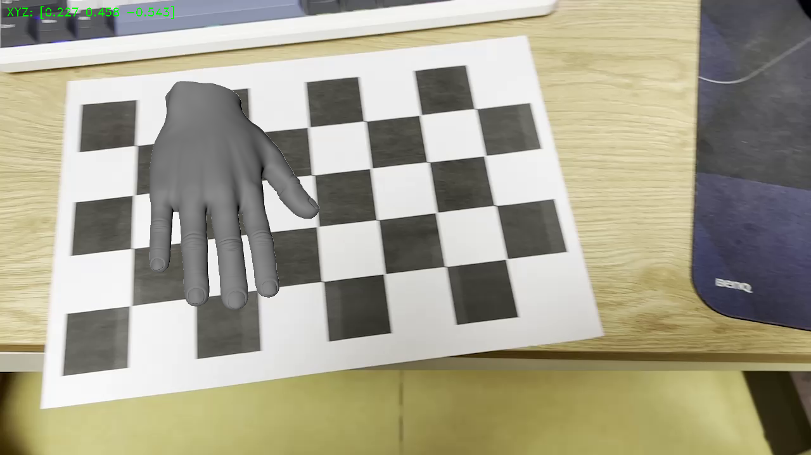
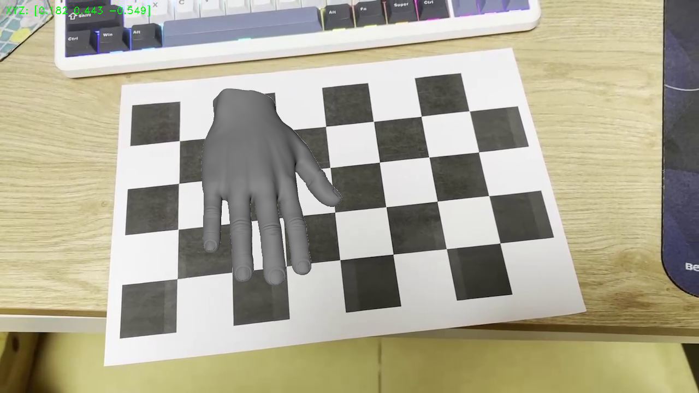
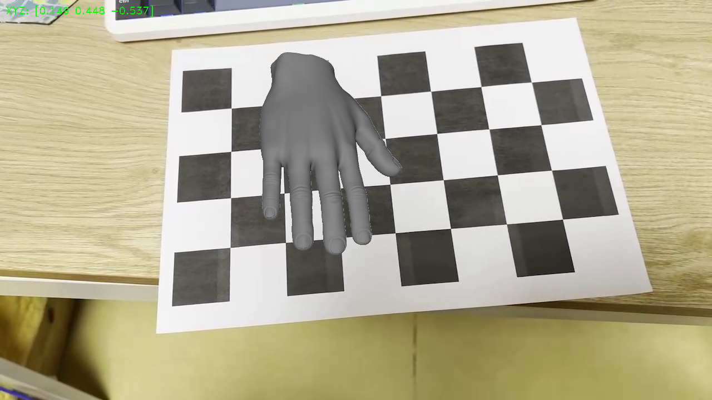

# my_simple_AR
my_camera_calibration 에서 얻은 데이터를 이용, 3D 모델 렌더링을 활용한 간단한 AR 데모

## AR rendering

- pyrender 와 trimesh 라이브러리를 사용하여 3D 모델을 렌더링.

### Example
  
  

---

## Controls

- `ESC` 키: 종료  
- `SPACE` 키: 일시 정지  
- `ENTER` 키: 스크린샷 저장 (`data/screenshot_01.png`, `screenshot_02.png`, ...)

---

## Dependencies
- 3D 모델: ["hand v1 3D 모델"](https://free3d.com/3d-model/hand-v1--945174.html)  
  라이선스: **[CC BY 4.0](https://creativecommons.org/licenses/by/4.0/)**
